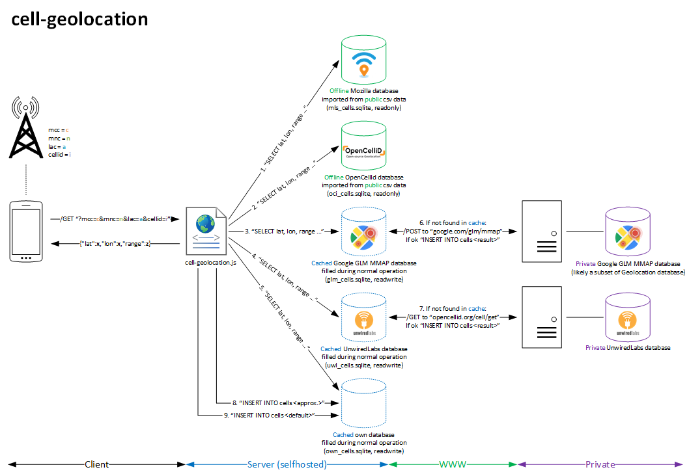

# Self hosted cell tower geolocation server
 
Моя версия...
 
A self hosted cell tower geolocation server inspired by [Jan Jongboom](https://github.com/janjongboom/opencellid).

You'll want to use this if you want to have the most complete, free and self hosted cell tower geolocation server.

Underneath the hood, the following data sources are used in descending order:
1. [Mozilla Location Service: offline database](https://location.services.mozilla.com/downloads)
2. [OpenCellId: offline database](https://www.opencellid.org/downloads.php)
3. Google GLM MMAP: self created cache database
4. OpenCellId (effectively a fallback to UnwiredLabs): self created cache database
5. Own cache database with approximated and default locations
6. [Google GLM MMAP: online service](https://github.com/kolonist/bscoords)
7. [OpenCellId (effectively a fallback to UnwiredLabs): online service](http://wiki.opencellid.org/wiki/API)
8. Approximated location according to midpoint of towers from OpenCellId offline database with same MCC, MNC and LAC (range: 2147483648)
9. Default location (lat: 46.909009, lon: 7.360584, range: 4294967295)

Remark: The OpenBmap / Radiocells.org offline database is not used, because it is considered tiny compared to the OpenCellId and Mozilla Location Service databases.

## Installation (database creation)

### SQLite extension-functions.c

    sudo apt-get install -y libsqlite3-dev
    wget -O extension-functions.c https://www.sqlite.org/contrib/download/extension-functions.c?get=25
    gcc -fPIC -lm -shared extension-functions.c -o libsqlitefunctions.so

### Mozilla Location Service database

    wget -O mls_cells.csv.gz "https://d17pt8qph6ncyq.cloudfront.net/export/MLS-full-cell-export-$(date -u "+%Y-%m-%d")T000000.csv.gz"
    cat mls_cells.csv.gz | gunzip - > mls_cells.csv
    cat schema.sql | sqlite3 mls_cells.sqlite
    cat mls_import.sql | sqlite3 mls_cells.sqlite

### OpenCellId database

    wget -O oci_cells.csv.gz "https://download.unwiredlabs.com/ocid/downloads?token=<YOUR_OPENCELLID_API_KEY>&file=cell_towers.csv.gz"
    cat oci_cells.csv.gz | gunzip - > oci_cells.csv
    cat schema.sql | sqlite3 oci_cells.sqlite
    cat oci_import.sql | sqlite3 oci_cells.sqlite
    cat oci_cells-cleanup.sql | sqlite3 oci_cells.sqlite

### Google GLM MMAP cache database

    cat cache_schema.sql | sqlite3 glm_cells.sqlite

### OpenCellId (effectively a fallback to UnwiredLabs) cache database

    cat cache_schema.sql | sqlite3 uwl_cells.sqlite

### Approximated and default cache database

    cat cache_schema.sql | sqlite3 own_cells.sqlite

## Running

Start the server:

    npm install
    OPENCELLID_API_KEY=<YOURS> node cell-geolocation.js

Use environment variables PORT and IP for different port/host. F.e.:

    PORT=1337 OPENCELLID_API_KEY=<YOURS> node cell-geolocation.js

## Queries and Responses (as of January 2019)

Query which can be answered by using the Mozilla Location Service database (1):

    curl -s 'http://localhost:5265/?mcc=228&mnc=1&lac=1212&cellid=7377222'
    {"lat":46.9226916,"lon":7.4132636,"range":1225}

Query which can be answered by using the OpenCellId database (2):

    curl -s 'http://localhost:5265/?mcc=228&mnc=1&lac=1212&cellid=7396209'
    {"lat":46.924667358398,"lon":7.3876190185547,"range":1000}

Query which can be answered by using the Google GLM MMAP online service (6):

    curl -s 'http://localhost:5265/?mcc=206&mnc=1&lac=3034&cellid=65927425'
    {"lat":51.183955,"lon":4.360369,"range":1148}

Query which can now be answered by using the Google GLM MMAP cache database (3):

    curl -s 'http://localhost:5265/?mcc=206&mnc=1&lac=3034&cellid=65927425'
    {"lat":51.183955,"lon":4.360369,"range":1148}

Query which can be answered by using the OpenCellId online service (7):

    curl -s 'http://localhost:5265/?mcc=206&mnc=1&lac=3023&cellid=66707986'
    {"lat":51.236893,"lon":4.473432,"range":1139}

Query which can now be answered by using the OpenCellId cache database (4):

    curl -s 'http://localhost:5265/?mcc=206&mnc=1&lac=3023&cellid=66707986'
    {"lat":51.236893,"lon":4.473432,"range":1139}

Query with non-existing cell tower which can be answered by using the approximated location (8):

    curl -s 'http://localhost:5265/?mcc=204&mnc=4&lac=212&cellid=99999999'
    {"lat":51.808904742260744,"lon":5.773231356632328,"range":2147483648}

Query which can now be answered by using the own cache database (5):

    curl -s 'http://localhost:5265/?mcc=204&mnc=4&lac=212&cellid=99999999'
    {"lat":51.808904742260744,"lon":5.773231356632328,"range":2147483648}

Query with non-existing cell tower which can only be answered by using the default location (9):

    curl -s 'http://localhost:5265/?mcc=0&mnc=0&lac=0&cellid=0'
    curl -s 'http://localhost:5265/?mcc=3100&mnc=41&lac=42971&cellid=9906077'
    {"lat":46.909009,"lon":7.360584,"range":4294967295}

The output is always a JSON object that has lat, lon and range.

## Maintenance

Remove entries in Google GLM MMAP cache database which are present in Mozilla Location Service database or OpenCellId database:

    node glm_cells-cleanup.js
    echo "VACUUM;" | sqlite3 glm_cells.sqlite

Remove entries in OpenCellId cache database which are present in Mozilla Location Service database, OpenCellId database, Google GLM MMAP cache database or online service:

    node uwl_cells-cleanup.js
    echo "VACUUM;" | sqlite3 uwl_cells.sqlite

Remove approximated locations in the own cache database (useful when assuming that the corresponding cells are now known by higher priority sources):

    echo "DELETE FROM cells WHERE range=2147483648;" | sqlite3 own_cells.sqlite
    echo "VACUUM;" | sqlite3 own_cells.sqlite

Remove default locations in the own cache database (useful when assuming that the corresponding cells are now known by higher priority sources):

    echo "DELETE FROM cells WHERE range=4294967295;" | sqlite3 own_cells.sqlite
    echo "VACUUM;" | sqlite3 own_cells.sqlite

Remove duplicate entries in Google GLM MMAP, OpenCellId and own cache database:

    echo "DELETE FROM cells WHERE rowid NOT IN (SELECT min(rowid) FROM cells GROUP BY mcc, mnc, lac, cellid);" | sqlite3 glm_cells.sqlite
    echo "VACUUM;" | sqlite3 glm_cells.sqlite
    echo "DELETE FROM cells WHERE rowid NOT IN (SELECT min(rowid) FROM cells GROUP BY mcc, mnc, lac, cellid);" | sqlite3 uwl_cells.sqlite
    echo "VACUUM;" | sqlite3 uwl_cells.sqlite
    echo "DELETE FROM cells WHERE rowid NOT IN (SELECT min(rowid) FROM cells GROUP BY mcc, mnc, lac, cellid);" | sqlite3 own_cells.sqlite
    echo "VACUUM;" | sqlite3 own_cells.sqlite

Find duplicate entries in Google GLM MMAP and OpenCellId cache database:

    echo "SELECT mcc, mnc, lac, cellid, count(*) as cell FROM cells GROUP BY mcc, mnc, lac, cellid HAVING count(*)> 1;" | sqlite3 glm_cells.sqlite
    echo "SELECT mcc, mnc, lac, cellid, count(*) as cell FROM cells GROUP BY mcc, mnc, lac, cellid HAVING count(*)> 1;" | sqlite3 uwl_cells.sqlite
    echo "SELECT mcc, mnc, lac, cellid, count(*) as cell FROM cells GROUP BY mcc, mnc, lac, cellid HAVING count(*)> 1;" | sqlite3 own_cells.sqlite

## Scripts

### Query Google GLM MMAP for e.g. MCC=206 MNC=1 LAC=3034 CELLID=65927425:

    python3 queryGlmMmap.py 206 1 3034 65927425
    51.183955|4.360369|1148

### Update entire database with values from GLM MMAP using 500 concurrent processes:

    python3 cells-update.py glm_cells.sqlite 500
    echo "VACUUM;" | sqlite3 glm_cells.sqlite

### Same as above but use proxies to perforn any requests:

    python3 cells-update.py glm_cells.sqlite 500 proxies
    echo "VACUUM;" | sqlite3 glm_cells.sqlite

### Same as above but only update entries where MCC is 206 or 208:

    python3 cells-update.py glm_cells.sqlite 500 direct "mcc IN (206, 208)"
    echo "VACUUM;" | sqlite3 glm_cells.sqlite

Remarks:
* Please note that the cells-update.py script can involve millions of requests to the Google GLM MMAP online service if invoked for mls_cells.sqlite or oci_cells.sqlite and can be considered as practically harvesting data which is otherwise (via Google Geolocation API) paid for.
* The cells-update.py script can make use of free elite proxies HTTP(S) servers to perform any requests in order to protect the machines public IP from being banned.
* The optimal number of concurrent processes varies depending on the machine and its internet bandwidth.

## Resources

OpenCellId and Mozilla Location Service [CSV Cell Fields](https://mozilla.github.io/ichnaea/import_export.html) definition.

## License

Released under the [WTFPL version 2](http://sam.zoy.org/wtfpl/).
